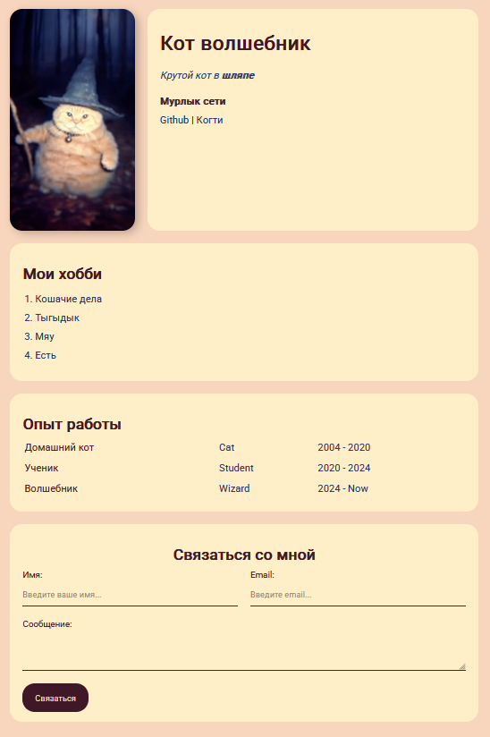

Вёрстка выполнена модульно, с использованием отдельных CSS-классов для каждого смыслового блока.

 

    
    

 

#### Особенности:
- Вёрстка реализована без использования JavaScript.
- Используются CSS-свойства: flexbox, box-shadow, border-radius.
